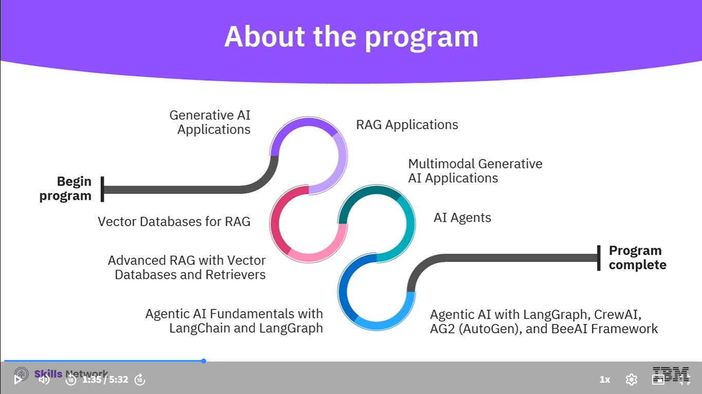

## Retrieval Augmented Generation, or RAG.
    Enhances AI's ability to provide accurate, context-aware responses by integrating real-time information retrieval.

## Multimodal AI 
    is another advancement that allows systems to process and integrate various types of data – text, images, audio, and video – enabling more dynamic and interactive user experiences.

## Agentic AI
    Represents a further shift, equipping systems with the ability to reason, plan, and autonomously execute tasks. 

    